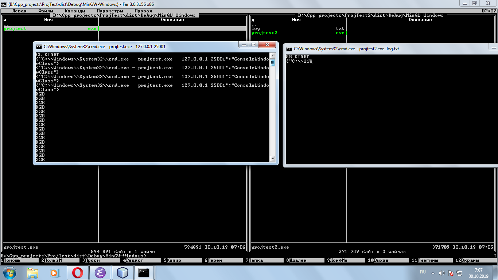

Тестовое задание для соискателей на вакансию C++-разработчика

Задание

Написать два приложения Клиент и Сервер. Клиент периодически собирает всю иерархию окон пользовательской сессии и отправляет ее в json-формате на сервер через tcp-соединение по сокету.
Задание выполнять в Microsoft Visual Studio Community 2015 Update 3 (желательно) или выше.

Общие требования 

1) WinAPI использовать для работы с сокетами, получения окон, WinAPI-ошибками и синхронизации потоков (Event, Mutex и т.д.).
2) Не приветствуется написание кода в С-стиле.
3) Обработка и вывод всех ошибок. Ошибки (включая и WinAPI-ошибки) нужно преобразовывать в человеко-читаемый вид.
4) Все приложения должны быть консольными.
5) Все приложения должны запускаться с правами администратора.
6) Все сообщения (ошибки, лог-сообщения и т.д.) должны выводится в консоль.
7) Должны присутствовать unit-тесты.
8) Приложения должны корректно и немедленно завершаться после ввода в консоль слова «exit».
9) Должна корректно обрабатываться ситуация разрыва соединения. Не требуется реализовывать корректное восстановление соединения и «догрузку» данных. 
10) Убедиться, что нет «утечек» сокетов.
Требования к Клиенту

          1) Адрес сервера для передачи данных должен задаваться через консоль перед началом работы приложения.
2) Периодичность сбора (и отправки) окон должна задаваться через консоль.
3) Должна корректно обрабатываться ситуация отсутствия сервера.
4) Окно должно содержать заголовок и класс.
5) Собирать только «видимые» окна.
6) Данные по окнам должны быть представлены в виде иерархии, которая должна соответствовать windows-иерархии.

Требования к серверу

1) Полученное сообщение от Клиента должно сохраняться в один файл.
2) Путь до директории для файла должен передаваться через консоль перед началом работы приложения.
3) Сервер должен поддерживать несколько клиентов.

Как получилось задание :

Выполнялось в NetBeams IDE 8.0. C++ стандарт 98.
Как сейчас работает:

